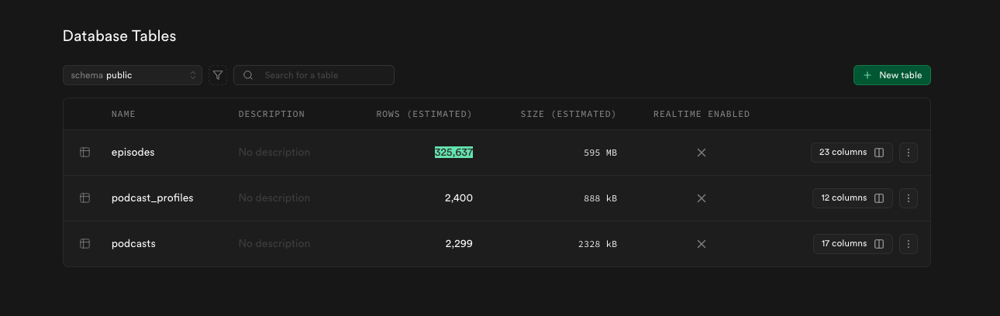

# Podcast DB

### GOAL

Find out **who’s talking about a company or person** in any Swedish podcast. Also just cool to have this kind of data and database.


### Tech Stack

1. Use Supabase to set up a simple database for storing the initial data. As i have a paid plan here already.

2. As we accumulate more data and need to store files, the plan is to use Scaleway S3 storage. My estimation is that i need about 8TB (€120 per month) of storeage space and scaleway only gives 750GB for free. We will probably need about 18TB (€180) of transfer. The total cost of this project would be some where around €300 for storage on scaleway.

3. Once we have the MP3 files, we need to transcribe all the podcasts. I'll use a couple of H200 GPUs for this; we have 8 GPUs worth €500,000 at work that I can borrow for this project. Thanks, boss for supporting this!. To store this text data we might want to use Cassandra. We use Grafana to monitor our scale way metrics, its quick to set up via 

4. In the GPU cluster, we’ll use a Whisper model to transcribe the data, or possibly another model that works well with Swedish.

5. The next step is to build our own search engine, or use Pinecone; TBD.

6. Finally, create a nice UI mabye built with lovable?

---

### PLAN

Scrape all podcasts in Sweden and build a searchable database.

---

### WHAT WE DO

#### Step 1

Get all podcasts in Sweden.

#### Step 2

Get each podcast’s profile and RSS feed URL.

#### Step 3

Fetch each RSS file and save it (plus metadata).

#### Step 4

Process RSS data for search and analysis.


#### Step 5
Do some ETL, Extract and load to database.


#### Step 6 
Download all the mp3s.


#### Step 7
Transcribe all the mp3s.

#### Step 8
Build a search function


#### Step 9
Build a UI

---

### BACKGROUND

I wanted a way to find where all Swedish podcasts are listed and found this endpoint:
`https://api.mediafacts.se/api/podcast/v1/podcasts`

That request returns every podcast ID and name in Sweden (approx 2400)

```json
{
    "adb8141c-fb56-4092-6f88-08dbd636bc42": "#Fallet",
    "e1e3a139-1b65-4a43-f843-08dbaa32d14e": "#FPLSVERIGE",
    ...
    "866dcf58-058d-4468-b0da-08dd8c879318": "...och bilen går bra?",
}
```

With that ID, we can get full details:

```bash
curl --location 'https://api.mediafacts.se/api/podcast/v1/podcasts/details?id=857538db-0c16-4f7d-b053-08dc85405cb3'
```

Example response:

```json
{
  "rssFeedUrl": "https://rss.podplaystudio.com/1477.xml",
  "podcastName": "Fallen jag aldrig glömmer",
  "supplierName": "Podplay",
  "networkName": "Bauer Media",
  "genre": "Thriller/Crime"
}
```

Main target: `rssFeedUrl`
Keep the rest (supplier, network, genre) for future analysis.

I’m using Supabase to store all data for fast iteration.

---

### STATUS

**Step 1 – Get podcast profiles**
Success rate: **99.04%**

```
status_code Distribution:
================================================================================
200                   2377 (99.04%)
404                     19 ( 0.79%)
400                      1 ( 0.04%)
410                      1 ( 0.04%)
500                      1 ( 0.04%)
503                      1 ( 0.04%)


Total unique status_code: 6
Null/Missing status_code: 0
```

Conslusion; Minor dataloss we dont cate to fix it now

```
RSS_request_status_code Distribution:
================================================================================
200                   2315 (96.46%)
404                     77 ( 3.21%)
400                      2 ( 0.08%)
410                      2 ( 0.08%)
500                      2 ( 0.08%)
503                      1 ( 0.04%)
0                        1 ( 0.04%)


Total unique RSS_request_status_code: 7
Null/Missing RSS_request_status_code: 0
```


Conclusion; Here the data loss is a bit more significant; But still enough. 

---

### RSS SOURCE DISTRIBUTION

Most feeds come from a few platforms:

```
Base URL Distribution:
================================================================================
https://feeds.acast.com                             1136 (47.33%)
https://feed.pod.space                               521 (21.71%)
https://api.sr.se                                    272 (11.33%)
https://rss.podplaystudio.com                        150 ( 6.25%)
https://rss.acast.com                                109 ( 4.54%)
https://podcast.stream.schibsted.media                94 ( 3.92%)
https://access.acast.com                              70 ( 2.92%)
https://feed.khz.se                                   20 ( 0.83%)
https://cdn.radioplay.se                              12 ( 0.50%)
http://www.ilikeradio.se                               8 ( 0.33%)
https://www.ilikeradio.se                              8 ( 0.33%)


Total unique base URLs: 11
Null/Missing RSS URLs: 0
```

Conslusion; This means that the structure is likley the same on all these platforms. Looking at the data we can see that most of the follow the same structure with Itunes tags with same names and title and links etc are the same. That consistency makes the ETL pipeline easy to build and maintain.

---

### RSS STRUCTURE

Most of them follow the same iTunes XML layout:

```xml
<item>
  <title>705. Lex Birgitta Ed</title>
  <pubDate>Thu, 23 Oct 2025 22:58:22 +0000</pubDate>
  <guid isPermaLink="false">7258a43677f100f9d45ef43f19395a99</guid>
  <link>https://pod.space/alexosigge/705-lex-birgitta-ed</link>
  <itunes:image href="https://assets.pod.space/system/shows/images/397/fef/88-/large/Alex_och_Sigge.jpg"/>
  <description><![CDATA[]]></description>
  <enclosure url="https://media.pod.space/alexosigge/aos705.mp3" type="audio/mpeg"/>
  <itunes:duration>00:59:21</itunes:duration>
</item>
```


### we manage to scrape about 326k podcasts in Step 5 of our ETL pipeline




### Next step will be to explore the data.

---

#### The download part of the mp3s

My first solution was to run it from my PC but the speed wasn't cutting it. I was downloading about 3000 podcasts an hour so this would take like 100 hours. So I started testing one of our new features - Parallel loop on Triform. It works by sending in a list in our case a list of URLs where each list  gets handled in its own action. Downloads are great to multithread so I spun up 10 threads and sent in 20 items per action to keep a pool going since some podcasts are 3 min and others are over an hour. There's probably faster ways to do it but Triform's actions are pretty small so I managed to max out the CPU utilization with this setup. Also there are some limitations to the payloads siceces both on output and input (TODO: we are going to fix that) plus some limitaions on how long an action can run for now that limitation is 15 minutes.

Anyway using Triform I got it down from ~100 hours to ~30 hours and went from 3000 podcasts per hour to about 9000 per hour.

We save the files in our S3 bucket using the podcast_id, since it’s unique for each podcast. As shown by this query, each id is unique. I also chose to organize the files in a folder within the bucket. While S3 doesn't have true folders (it only appears that way in the UI), using folders doesn't affect performance and allows us to store related metadata or output text alongside the files in that folder.


